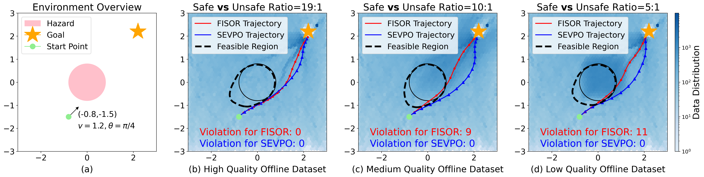
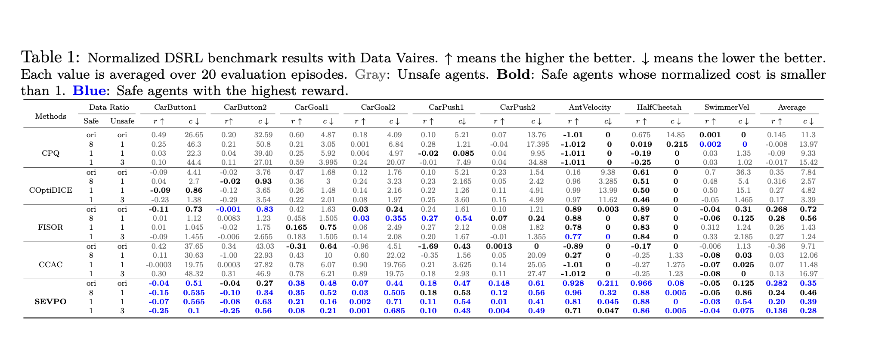

<h1 align="center">
  SEVPO: Divide and Conquer:<br>
  Selective Value Learning and Policy Optimization<br>
  for Offline Safe Reinforcement Learning
</h1>

<p align="center">
  <a href="https://openreview.net/forum?id=4KYrv6qYMl">
    
  </a>
  <a href="https://youtu.be/tDpWq2EV_Ig">
    
  </a>
  <a href="https://github.com/google/jax">
    
  </a>
  <a href="https://github.com/liuzuxin/DSRL">
    
  </a>
</p>

<p align="center">
  Official implementation of
  <a href="https://openreview.net/forum?id=4KYrv6qYMl">
    <em>Divide and Conquer: Selective Value Learning and Policy Optimization for Offline Safe Reinforcement Learning</em>
  </a>.
</p>

<p align="center">
  <a href="https://youtu.be/tDpWq2EV_Ig"><strong>Watch the robot demo</strong></a>
  &nbsp;|&nbsp;
  <a href="https://openreview.net/forum?id=4KYrv6qYMl"><strong>Read the paper</strong></a>
</p>

---

This repository contains the official implementation of **SEVPO**, a divide-and-conquer framework for **offline safe reinforcement learning**.
SEVPO separates value learning and policy optimization according to state safety:
it performs reward-driven optimization in safe regions while switching to
cost-minimization in unsafe regions to recover feasible behavior from fixed offline data.

The paper is currently available on OpenReview as a TMLR submission:
[openreview.net/forum?id=4KYrv6qYMl](https://openreview.net/forum?id=4KYrv6qYMl).

<p align="center">
  
</p>

## Main Results

<p align="center">
  
</p>

## Highlights

- **Selective value learning** for separating safety-preserving and unsafe states.
- **Policy optimization with region-aware objectives** for balancing reward and constraint satisfaction.
- **Robustness to offline dataset quality**, including settings with different safe-to-unsafe data ratios.
- **JAX/Flax implementation** with DSRL and Safety-Gymnasium style offline safe RL environments.

## Repository Structure

```text
SEVPO/
├── assets/
│   ├── performance_toy.png
│   ├── table1.png
│   └── sevpo-demo.mp4
├── code/
│   ├── configs/          # SEVPO experiment configuration
│   ├── env/              # task list and toy environment
│   ├── model/            # agent, networks, datasets, wrappers, evaluation
│   └── train/            # training entry point
├── requirements.txt
└── README.md
```

## Installation

Create a clean Python environment and install the dependencies:

```bash
git clone https://github.com/JiahuiZhu666/SEVPO.git
cd SEVPO

python -m venv .venv
source .venv/bin/activate
pip install --upgrade pip
pip install -r requirements.txt
```

If you use CUDA-enabled JAX, install the JAX build that matches your CUDA version
following the official JAX installation guide.

## Quick Start

Run training from the `code` directory so local imports resolve correctly:

```bash
cd code
python -m train.train \
  --config=configs/sevpo_config.py:sevpo \
  --env_id=9
```

The default `env_id=9` runs the toy environment. Other task IDs are defined in
[`code/env/task_list.py`](code/env/task_list.py).

You can optionally set the Weights & Biases project name:

```bash
python -m train.train \
  --config=configs/sevpo_config.py:sevpo \
  --env_id=9 \
  --project=SEVPO
```

Training outputs are written to `results/`, which is ignored by Git.

## Configuration

The main experiment configuration is in
[`code/configs/sevpo_config.py`](code/configs/sevpo_config.py).
Important fields include:

- `model_cls`: SEVPO agent class.
- `cost_limit`: safety constraint limit.
- `critic_type`: cost-value learning target.
- `sampling_method`: diffusion policy sampler.
- `dataset_kwargs`: dataset path and cost scaling.

## Assets

- [`assets/performance_toy.png`](assets/performance_toy.png): performance visualization from the paper.
- [`assets/table1.png`](assets/table1.png): Table 1 from the paper.
- [`assets/sevpo-demo.mp4`](assets/sevpo-demo.mp4): demo video.

## Citation

If you find this code useful, please cite the paper. The citation entry will be
updated after the TMLR review process is finalized.

```bibtex
@misc{sevpo2026,
  title        = {Divide and Conquer: Selective Value Learning and Policy Optimization for Offline Safe Reinforcement Learning},
  year         = {2026},
  howpublished = {OpenReview},
  url          = {https://openreview.net/forum?id=4KYrv6qYMl}
}
```

## Acknowledgements

This implementation builds on the JAX/Flax ecosystem and offline safe RL
benchmarks such as DSRL and Safety-Gymnasium.
